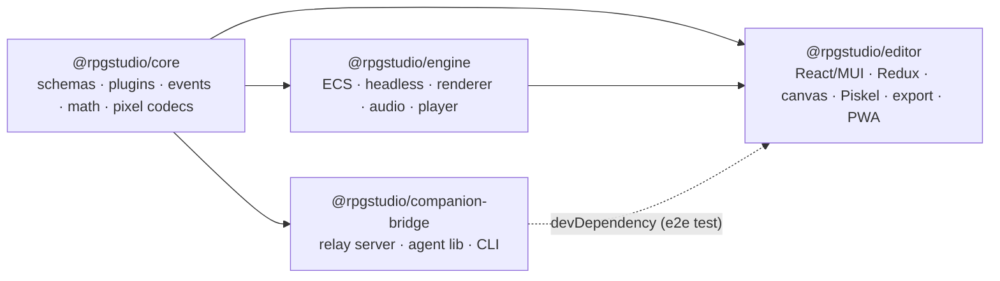
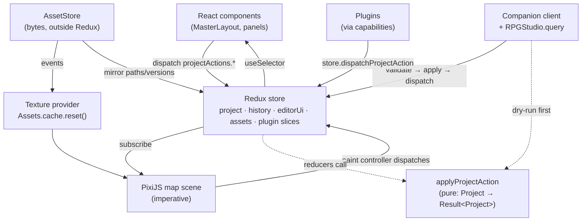
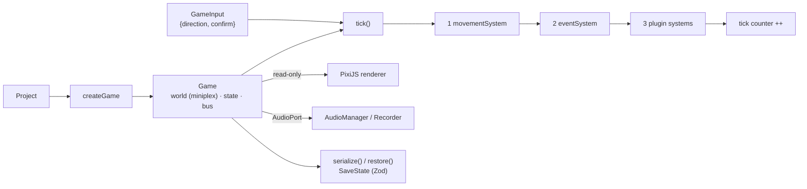
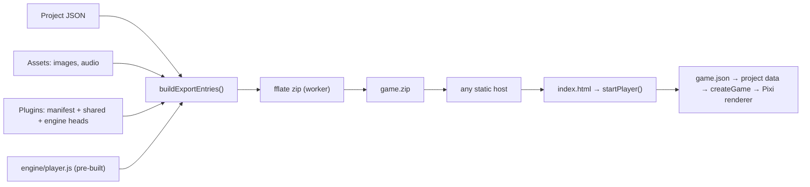
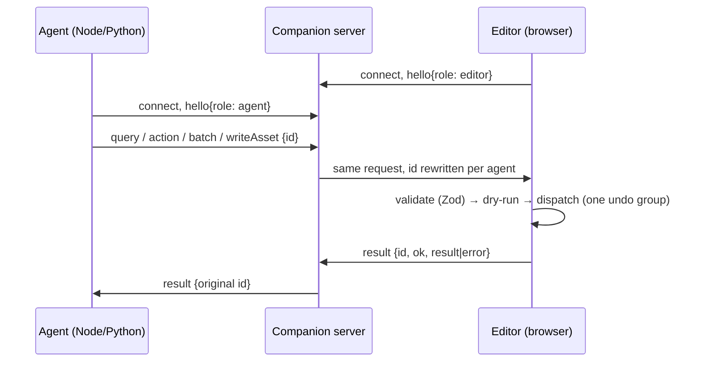

# Architecture

This is the map of the system. For the reasoning behind each choice see
[decisions.md](decisions.md); for per-area detail see [data-model.md](data-model.md),
[engine.md](engine.md), [editor.md](editor.md), [plugins.md](plugins.md) and
[companion-protocol.md](companion-protocol.md).

## 1. The idea in one paragraph

A game is a **project**: a handful of strict-JSON files plus image/audio assets. The
**editor** loads a project into a Redux store and changes it only through validated,
pure **project actions**. The **engine** loads the same project and runs it as a
deterministic simulation (an ECS stepped at 60 ticks per second) that can run with no
browser at all. **Export** packs the project, the pre-built engine player and the
engine-side parts of any plugins into a static web bundle. An **AI agent** can do
everything a human can in the editor by talking to a local relay; its requests pass
through exactly the same validation as the UI's.

## 2. Packages and dependencies



| Package                                | Runs in                | Hard rules                                                       |
| -------------------------------------- | ---------------------- | ---------------------------------------------------------------- |
| `core`                                 | browser, Node, workers | No DOM, no UI, no rendering, imports nothing from other packages |
| `engine` (root entry)                  | browser **and Node**   | Must not import PixiJS (headless)                                |
| `engine/renderer`, `/audio`, `/player` | browser                | May import PixiJS / `@pixi/sound`                                |
| `editor`                               | browser                | Imports `engine/renderer` for textures and tile batching only    |
| `companion-bridge`                     | Node                   | Talks to the editor only over the wire protocol                  |

## 3. The project (the unit everything revolves around)

```
project.json                  ProjectMeta: name, start map/position/party, plugin ids…
data/actors.json              Actor[]   (also classes, items, skills, enemies)
maps/map-001.json             Tilemap   (one file per map)
img/{characters,tilesets,…}/  PNGs and their .piskel sources
audio/{bgm,bgs,me,se}/        audio files
plugins/<id>/                 manifest.json + shared/editor/engine entry modules
```

In memory it is one `Project` object (`meta`, `database`, `maps`) validated by
`ProjectSchema`, plus an `AssetStore` of the non-JSON files. `projectToFiles` and
`filesToProject` (core) convert between the two forms; they are the only code that knows
the file layout. See [data-model.md](data-model.md).

## 4. The editor at runtime



Key properties:

- **One mutation path.** Every project change is `applyProjectAction(project, action)`,
  a pure function that returns the next project (sharing untouched parts) or a reason
  for refusing. Reducers call it; so do the AI bridge (for a dry run) and the UI (for
  pre-checks). A refused action leaves state untouched _by reference_.
- **Undo is middleware** that snapshots the structurally shared project. Actions with the
  same `meta.historyGroup` in a row are one step (a brush stroke, an AI batch).
- **Bytes live outside Redux.** Images and audio are not serialisable, so the
  `AssetStore` holds them and Redux mirrors only paths and a version number. Any asset
  change resets the texture cache, which is how a saved sprite reaches the map canvas live.
- **The canvas is imperative.** React owns the element and its lifetime; PixiJS is driven
  straight from store subscriptions so pointer moves never cause React renders.
- **Plugins are first-class.** The map editor, database editor and sprite editor are
  plugins registered through the same capabilities as third-party ones.

## 5. The engine at runtime



- The simulation is **fixed-step** (1 tick = 1/60 s) and **deterministic**: same project,
  seed and inputs give identical results. The seeded RNG state is part of every save.
- `Game` has no knowledge of pixels or sound. The renderer _reads_ it; audio goes
  through an `AudioPort` interface (a recorder in headless runs).
- The same `createGame` powers the browser player, the AI playtest harness
  (`createHeadlessGame`) and the engine's tests.

## 6. Export and the player



`buildExportEntries` is a pure function and the single place that decides what ships. It
**strips** `.piskel` sources and editor-only plugin files, and **refuses** to export a
project that cannot run (missing tileset, broken plugin). The player discovers files
through `game.json` because static hosts cannot list directories. See
[editor.md](editor.md#7-export).

## 7. The AI bridge



The editor connects **out** to the server; agents connect **in**. The server only
relays and enforces connection security (origin checks, optional token). All semantic
validation happens in the editor. See [companion-protocol.md](companion-protocol.md).

## 8. Cross-cutting design

**Validation boundaries.** Zod runs where data enters, and nowhere in a hot path:

| Boundary                      | Where                                              |
| ----------------------------- | -------------------------------------------------- |
| Opening a project folder/zip  | `filesToProject` → `ProjectSchema`                 |
| Loading an exported game      | `loadGameBundle` → `filesToProject`                |
| Headless project input        | `createHeadlessGame` → `ProjectSchema.parse`       |
| Restoring a save              | `game.restore` → `SaveStateSchema` + cross-checks  |
| Plugin manifest               | `PluginManifestSchema` at `register`               |
| AI / console / plugin actions | `ProjectActionSchema` in the handler / host        |
| WebSocket messages            | `*ToServerSchema` / `ServerTo*Schema` on every hop |
| Piskel iframe messages        | `AdapterMessageSchema`                             |
| Agent-supplied asset paths    | `AssetPathSchema` (no traversal)                   |

**Error handling.** Operations that can be legitimately refused return `Result` with a
message precise enough for an AI to correct itself ("Action 3 (project/setTiles) was
refused: Cell (99, 0) is outside the 6x4 map").

**Determinism.** No `Math.random` or `Date.now` inside the simulation; randomness goes
through `createRng(seed)`. Time enters only as ticks.

**Security posture.** Untrusted inputs are AI agents, third-party plugins, imported
archives and anything on a WebSocket. Mitigations: strict schemas, capability-sandboxed
plugin contexts, path allow-lists, archive traversal/size checks, loopback-only relay
with origin checks, and a sandboxed same-origin Piskel iframe that only accepts messages
from its own window.

## 9. Repository layout in full

See each package's `AGENTS.md` for a file-by-file map. Top level:

```
AGENTS.md  CLAUDE.md  README.md  docs/
package.json  pnpm-workspace.yaml  tsconfig.base.json  tsconfig.json
eslint.config.js  vitest.config.ts  .prettierrc.json  vercel.json
tooling/            shared Vite/Vitest helpers + docs checker
packages/core  packages/engine  packages/editor  packages/companion-bridge
```
